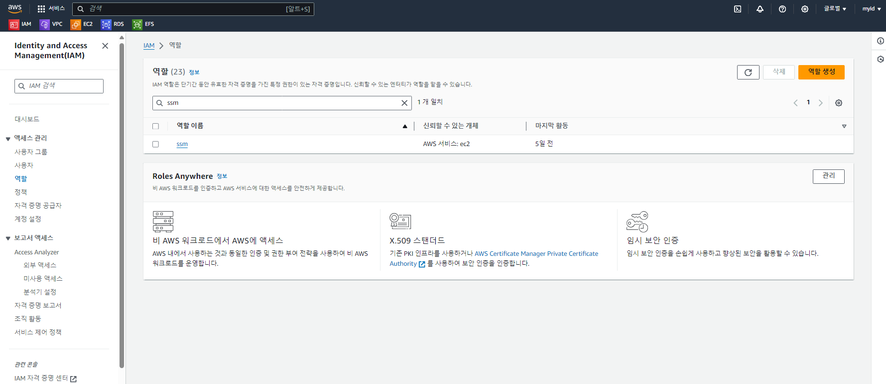
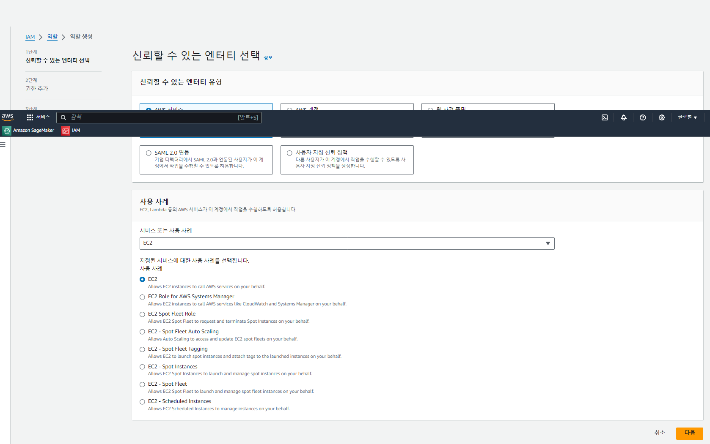
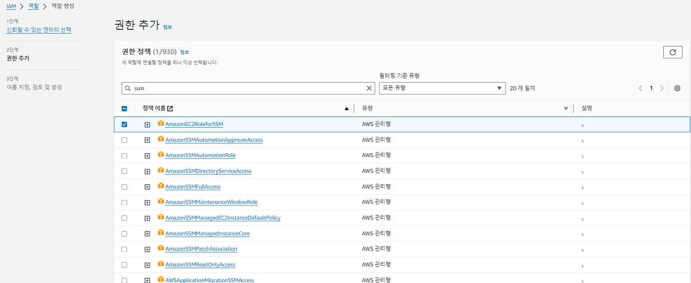
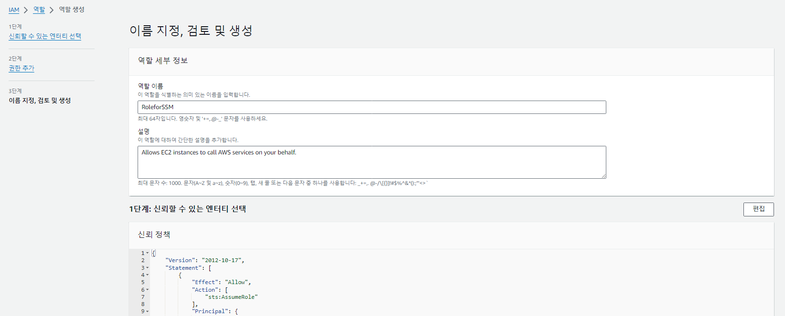

## AWS IAM
### AWS IAM User 생성 
 - workshop-user

### IAM Role 생성
 - EC2 접속을 위한 Role 생성

 - Launch template 생성시 EC2 Role 로 지정
    

### IAM role 생성

- IAM > 역할 > 역할 만들기
- 사용사례 EC2 선택 
 

- 권한 추가
    - AmazonEC2FullAccess
    - AmazonElasticFileSystemFullAccess
    - AmazonRDSFullAccess
    - AmazonSSMFullAccess
  

- IAM Role 이름 설정
  

***
