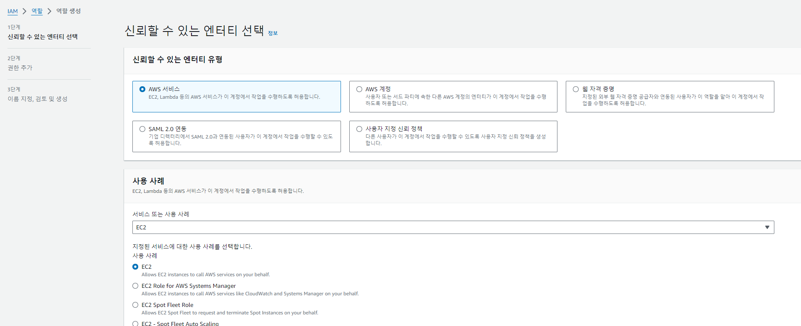
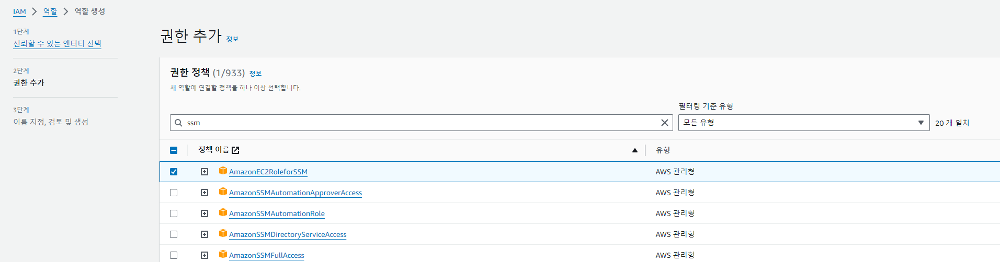

## AWS IAM
### AWS IAM User 생성 
 - 루트사용자는 계정의 관리자입니다
 - IAM User는 해당계정의 사용자로 처음 계정을 만들면 사용자가 존재하지 않습니다
 - MAIN LAB 을 수행할 사용자를 생성합니다
    - IAM User Name : workshop-user

 - IAM User(workshop-user) 권한 추가
    - AmazonEC2FullAccess
    - AmazonElasticFileSystemFullAccess
    - AmazonRDSFullAccess
    - AmazonSSMFullAccess

### IAM role 생성

- IAM > 역할 > 역할 만들기
- 사용사례 EC2 선택 > 다음

- EC2 접속을 위한 SSM 정책 부여

- IAM Role 이름 설정
  

### IAM role 사용
#### Launch template EC2 Role 지정 
 - 해당 Role(역할)은 향후 EC2 생성시 사용합니다
 - Launch template 생성 >  EC2 IAM Role > "RoleforSSM"(생성한 Role) 로 지정
    

***