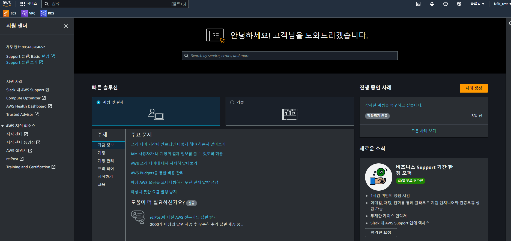

## AWS 리소스 삭제 가이드
 - CASE 1: AWS 계정이 아직 있는 경우
   - [STEP 1](/Delete/STEP1.md) : 비용이 발생한 리소스 확인
      - 계정관리 "Cost Explorer" 로 비용 확인 시 최대 1시간 지연이 있을수 있습니다
   - [STEP 2](/Delete/STEP2.md) : 리소스 관리 콘솔로 이동
   - [STEP 3](/Delete/STEP3.md) : 리소스 삭제
   - [STEP 4](/Delete/STEP4.md) : 리소스 비용 발생 재 확인

 - CASE 2: 이미 AWS 계정을 해지한 경우
   - AWS Support에 계정 복구요청(아래 복구 절차 참조) 
     (일반적으로 계정복구까지 3~5일 소요)
   - 계정복구 후 CASE 1 진행
     

   ### 복구 절차
   #### "aws support" 클릭
      - "AWS Support" 클릭시 해당 콘솔로 이동됨   
      
      - 카테고리 선택
      
      - 계정복구 문의
      
      
***
***
