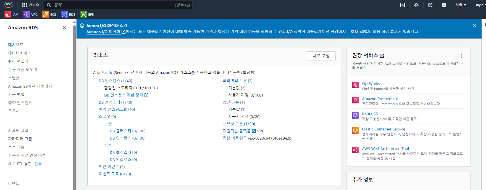
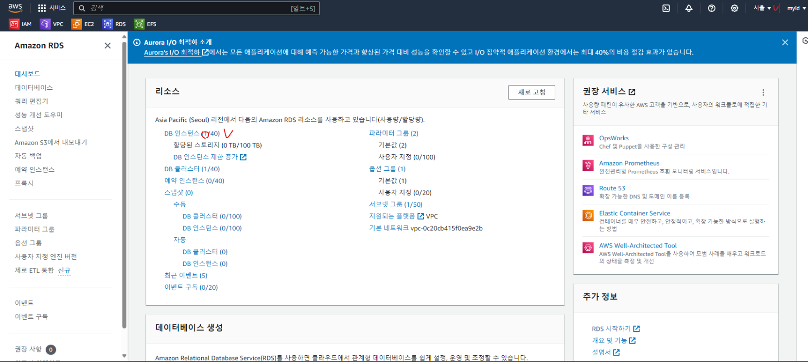
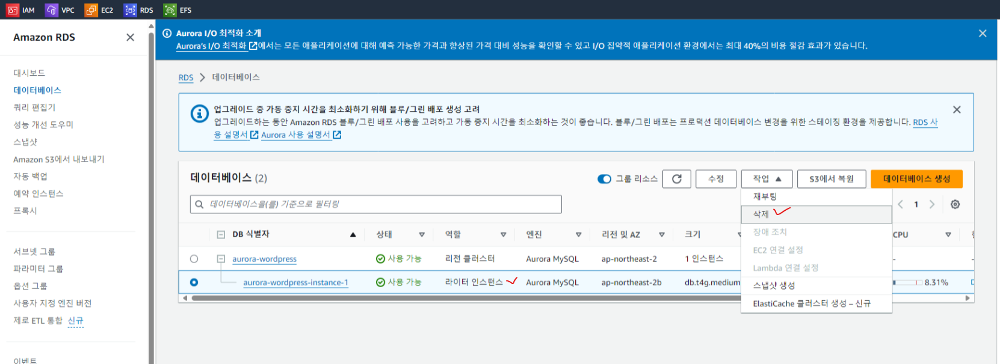
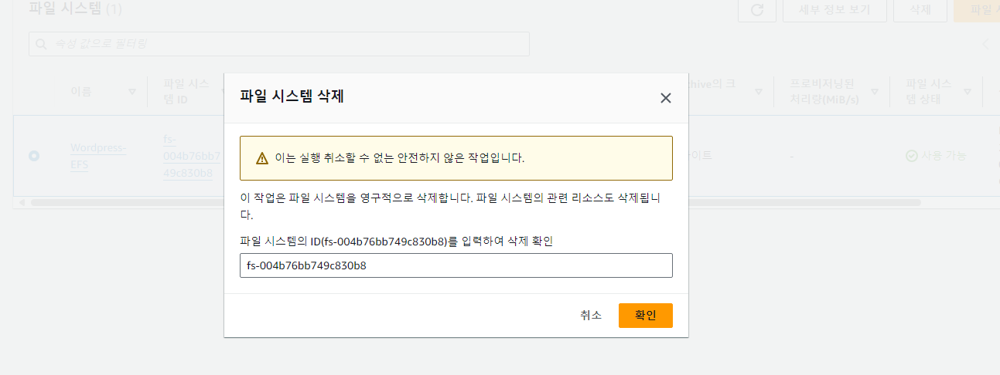
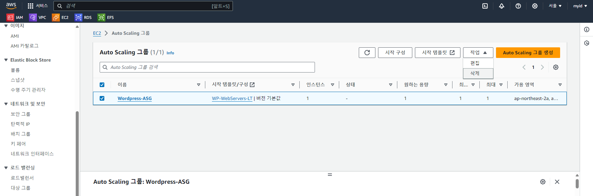
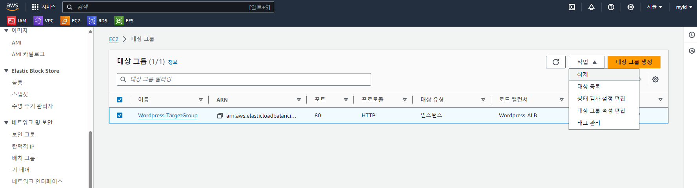
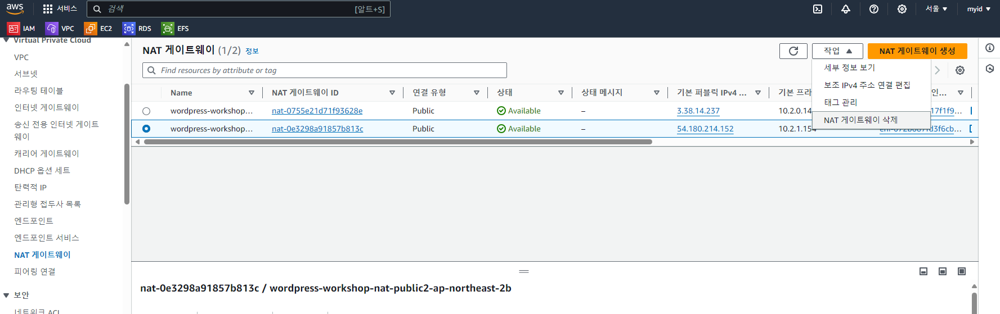
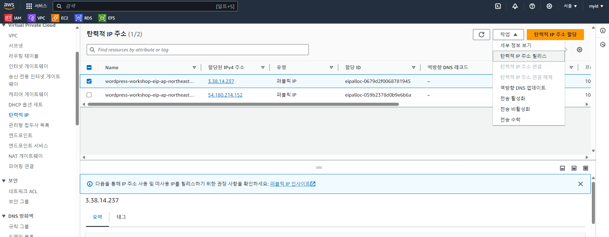
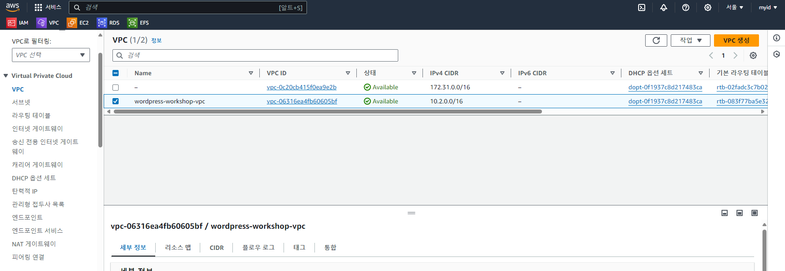

## AWS Console 홈
 - AWS 콘솔 로그인후 첫 화면에서 우측 상단 "내계정"(예시:"myid") 클릭

    

 - 클릭후 드롭다운 메뉴에서 "계정" 클릭
    

 - 해당 Console 화면에서 "과금정보 및 비용관리" > "Cost Explorer" 클릭
    

 - "Cost Explorer" 화면에서 우측 사이드바 메뉴의 "시간", "세분성"을 조절합니다  
 - 시간은 계정을 만든 이후부터 조회하는 날까지 선택합니다
 - 세분성은 메뉴를 드롭다운하여 "일별"로 변경합니다
    

 - 선택이후에는 날짜범위와 세분성이 각각 "설정한 기간", "일별"로 선택이 되있어야 합니다
 - 선택을 완료하면 일별 비용과 현재까지 누적된 금액이 상단에 금액과 그래프로 표시됩니다 
    
 - 스크롤을 내리면 어떤 리소스에서 비용이 발생하였는지 알수 있으며,  
   대게 실습에 사용한 VPC, RDS, EFS, EC2 4가지 항목중 하나에서 비용이 발생하여야 합니다  
   다른 리소스에서 비용이 발생했다면 아래 절차와 동일한 방법으로 해당 콘솔로 이동하여 리소스를 삭제하세요   
    

***
***

## 리소스 삭제
 - 비용이 발생한 리소스명을 확인하고 차례로 리소스 명을 복사후 검색에 붙여넣습니다  
   (아래 예시처럼 검색이 되지 않으면 단어 앞자만 붙여서 서비스를 검색해주세요)
    
    
 - "Relational Database Service" 서비스 검색결과가 없어 RDS 로 다시 검색합니다
    

## RDS 콘솔
### RDS 삭제
 - RDS(DB) 리소스 삭제는 다른 리소스보다 시간이 오래 소요되는 작업으로 먼저 진행합니다
 - 리전을 변경해 가며 RDS 콘솔 대시보드에서 DB 인스턴스가 있는지 확인합니다
    
    

 - RDS DB 인스턴스 "라이터"를 선택한 후에 "작업"을 눌러 삭제를 진행합니다 
    
    

 - 라이터 DB 인스턴스 삭제후 나머지 RDS 클러스터를 삭제를 진행하며 이때 "최종 스냅샷 생성"은 해제하고,  
   "인스턴스 삭제시 ~" 경고문구를 체크하여 확인합니다
    

## EFS 콘솔
### EFS 삭제
 - EFS 콘솔로 이동후 삭제를 진행합니다
    
    

***
## EC2 콘솔
### EC2 삭제
 - EC2 콘솔로 이동하여 ASG 선택후 삭제를 진행합니다
    
 
 ### ALB Load Balancers 삭제
 - EC2 콘솔 > 로드밸런서 로  ALB 삭제를 진행합니다
    
 
 ### ALB Target Groups 삭제
 - EC2 콘솔 > 대상그룹 으로  ALB 삭제를 진행합니다
   

   ***
## VPC 콘솔
### NAT 삭제
 - NAT 
    
 
### 탄력적 IP 삭제
 - 탄력적 IP
    

### VPC 삭제
 - EC2 콘솔로 이동하여 ASG 선택후 삭제를 진행합니다
    
 