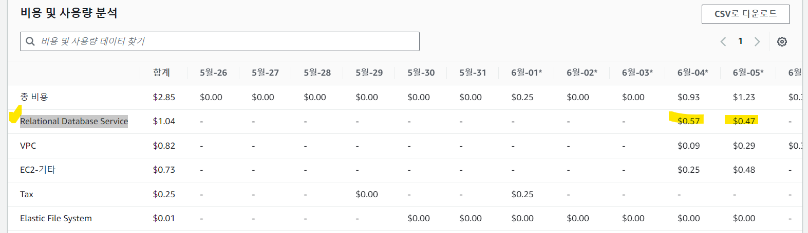
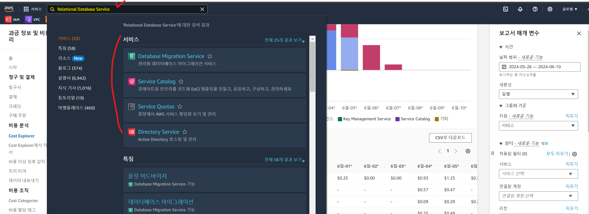
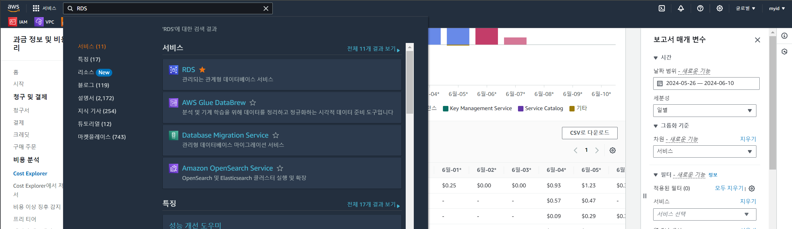

### STEP 2 : 리소스 관리 콘솔로 이동
 
 - 비용이 발생한 리소스명을 확인하고 차례로 리소스 명을 복사후 검색에 붙여넣습니다  
   (아래 예시처럼 검색이 되지 않으면 단어 앞자만 붙여서 서비스를 검색해주세요)
    
    
 - "Relational Database Service" 서비스 검색결과가 없어 RDS 로 다시 검색합니다
    