# STEP 3 : 리소스 삭제

## [RDS 콘솔]
### RDS 삭제
 - RDS(DB) 리소스 삭제는 다른 리소스보다 시간이 오래 소요되는 작업으로 먼저 진행합니다
 - 리전을 변경해 가며 RDS 콘솔 대시보드에서 DB 인스턴스가 있는지 확인합니다
    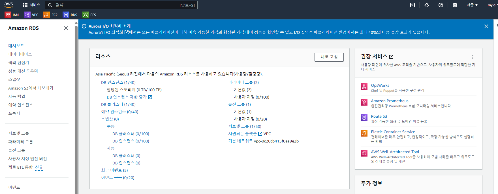
    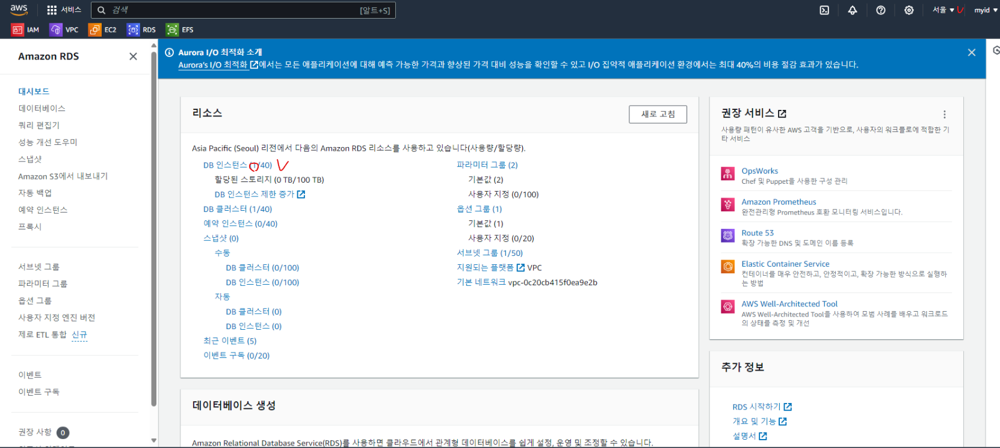

 - RDS DB 인스턴스 "라이터"를 선택한 후에 "작업"을 눌러 삭제를 진행합니다 
    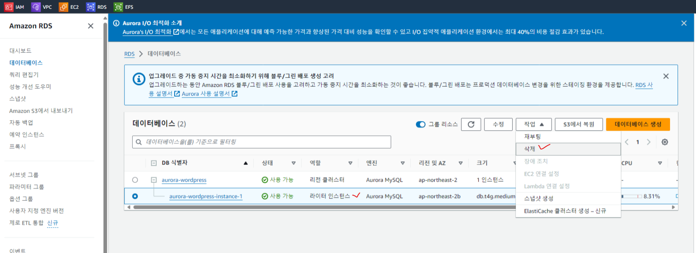
    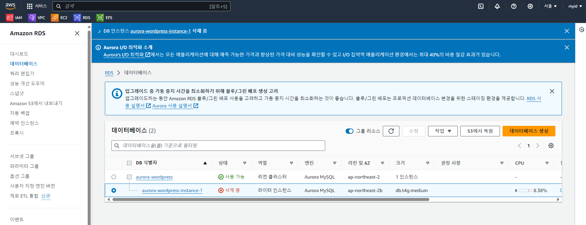

 - 라이터 DB 인스턴스 삭제후 나머지 RDS 클러스터를 삭제를 진행하며 이때 "최종 스냅샷 생성"은 해제하고,  
   "인스턴스 삭제시 ~" 경고문구를 체크하여 확인합니다
    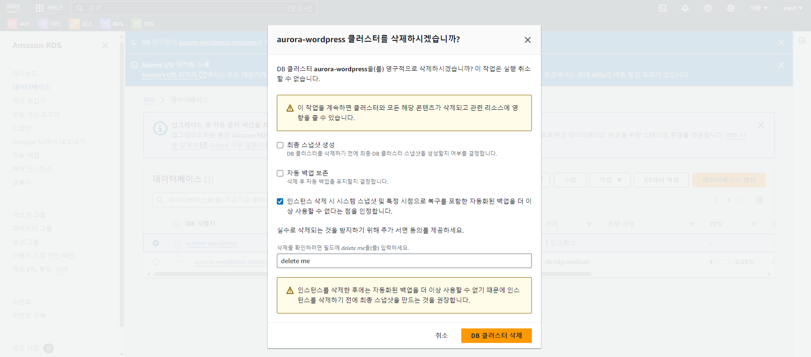

***
***
## [EFS 콘솔]
### EFS 삭제
 - EFS 콘솔로 이동후 삭제를 진행합니다
    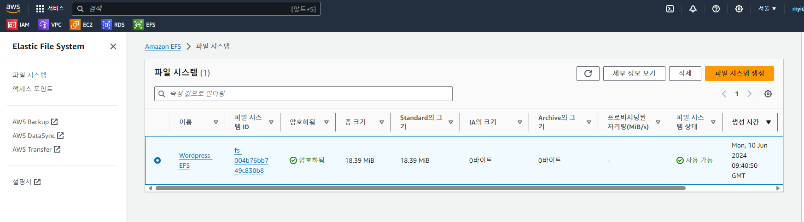
    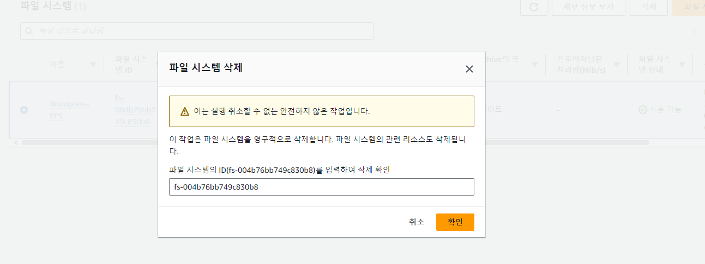

***
***
## [EC2 콘솔]
### EC2 삭제
 - EC2 콘솔로 이동하여 ASG 선택후 삭제를 진행합니다
    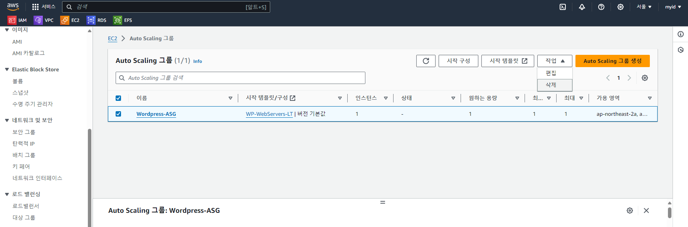
 
### ALB Load Balancers 삭제
 - EC2 콘솔 > 로드밸런서 로  ALB 삭제를 진행합니다
    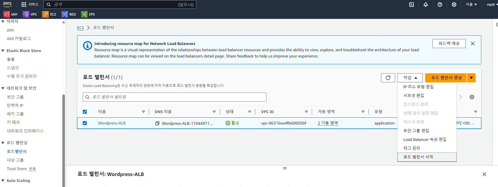
 
#### ALB Target Groups 삭제
 - EC2 콘솔 > 대상그룹 으로  ALB 삭제를 진행합니다
   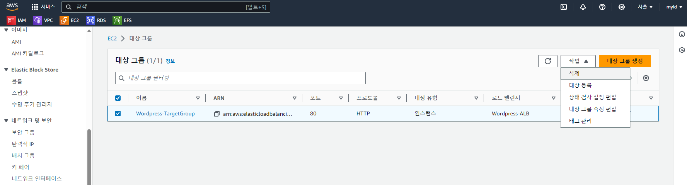

***
***

## [VPC 콘솔]
### NAT 삭제
 - NAT 
    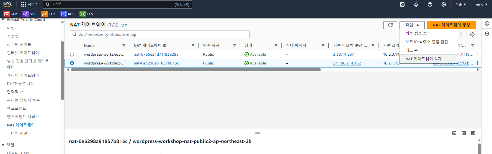
 
### 탄력적 IP 삭제
 - 탄력적 IP
    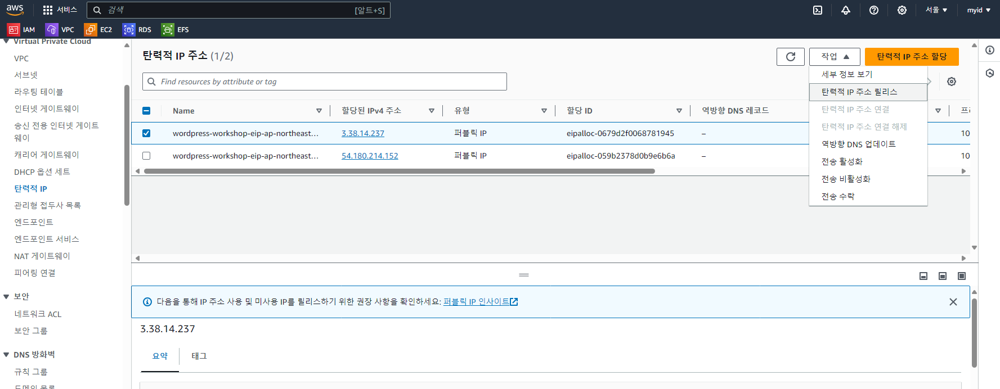

### VPC 삭제
 - EC2 콘솔로 이동하여 ASG 선택후 삭제를 진행합니다
    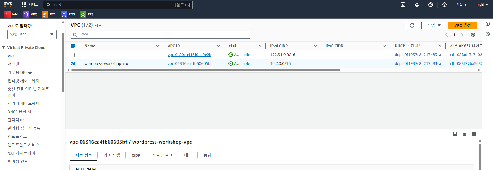
 
 ***
 ***