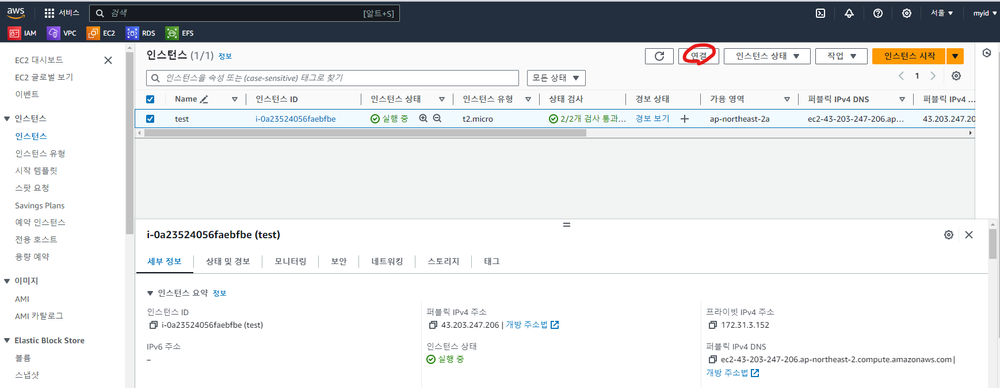
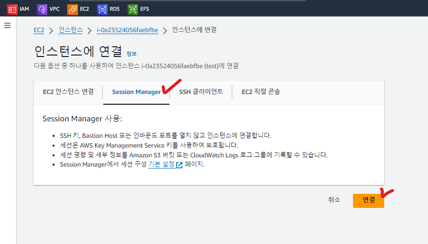

## AWS Session Manager란
- [ ] Session Manager는 대화형 원클릭 브라우저 기반 셸 또는 AWS CLI를 통해 Amazon EC2 인스턴스를 관리할 수 있는 AWS Systems Manager의 기능입니다. Session Manager를 사용하여 계정의 인스턴스에 세션을 시작할 수 있습니다. 세션이 시작된 후, 다른 연결 유형을 통해 bash 명령을 실행할 수 있습니다.
    - 관리형 노드에 대한 중앙 집중식 액세스 제어
    - 세션 활동 로깅 및 감사
    - 불필요한 인바운드 포트를 제거 

***
### EC2 접속
- [ ] EC2콘솔로 이동해서 "연결"버튼을 클릭합니다
  

- [ ] "연결" > "Session Manager" 탭 > "연결"
  