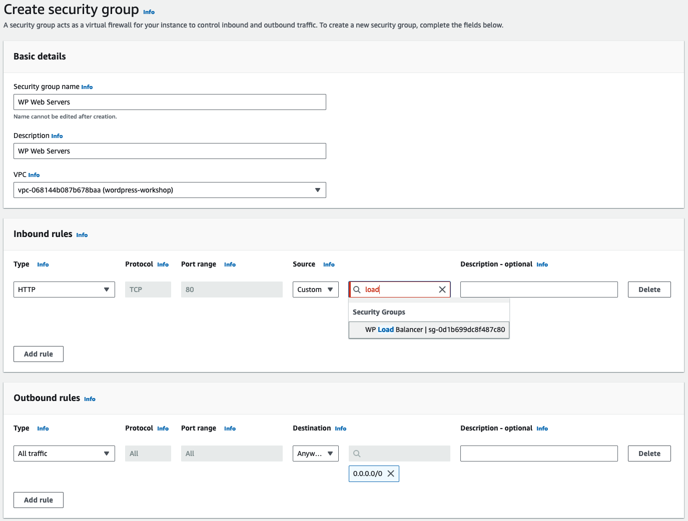
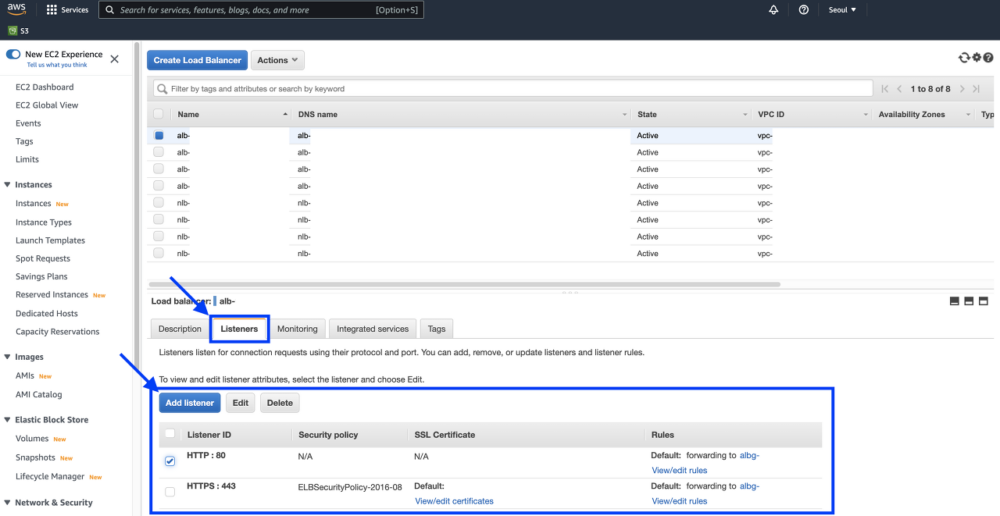
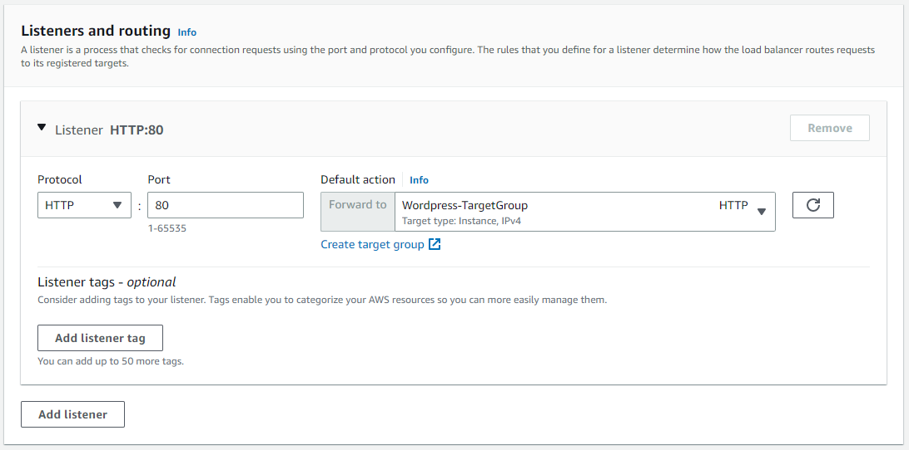
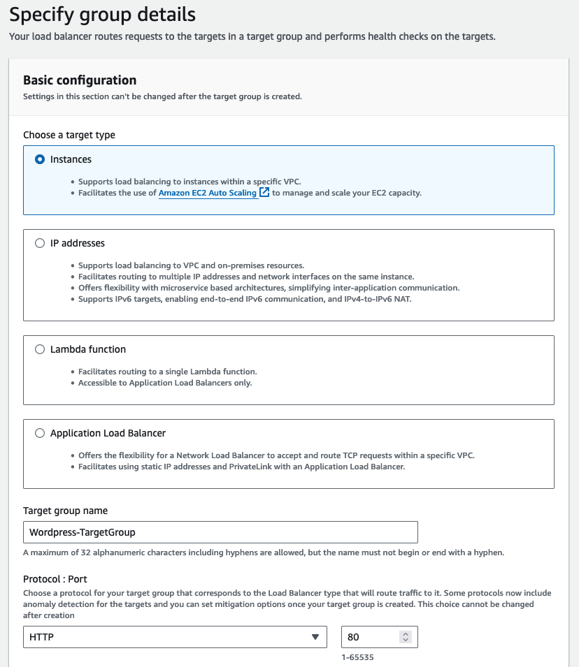
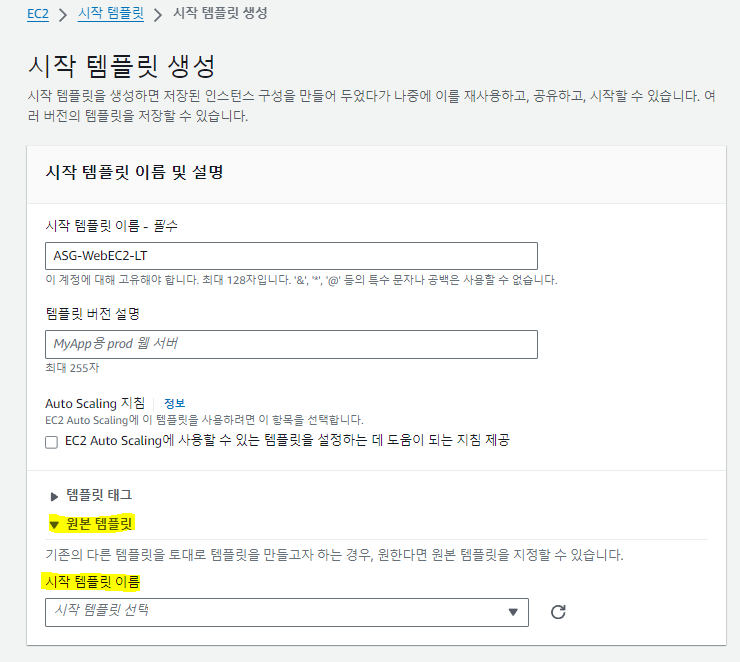

## Auto Scaling 테스트

### Security Group 생성
- [ ] Inbound Rules 추가
    - 이전 LAB에 구성한 SG "WP Web Servers" 포트에 [8080] 를 입력하고  
    Source로 "WP Load Balancer" 를 선택합니다
    

### Web Server 추가
- [ ] ALB Listeners 추가
    - 기존 리스너 포트에 [8080]을 추가합니다
    
    ##
    - ALB TargetGroup으로 "EC2-TargetGroup" 생성하고, ALB Target으로 등록합니다
    - 여기서 Listener 는 "HTTP : 8080" 을 사용합니다
    
    ##
    - ALB TargetGroup에서 "Protocol : Port" 는 [80]을 입력합니다
    - Health checks 는 "/"를 사용합니다
    

### Launch Template 생성   
- 접속된 EC2 정보를 표시해주는 간단한 웹 서버를  
부하가 증가하면 AutoScale-out 이 되도록 구성해 봅니다

##
- [ ] 부하분산 테스트를 진행할 ASG "ASG-WebEC2-LT" 를 생성합니다
    - 원본 템플릿에 이전 LAB에서 구성한 Launch Template "WP-WebServers-LT"을 선택합니다
    

    ##
    -  user date(사용자 데이터) 구성

        ```
        #!/bin/bash

        # To connect to your EC2 instance and install the Apache web server with PHP

        yum update -y

        yum install -y httpd php8.1
        systemctl enable httpd.service
        systemctl start httpd
        cd /var/www/html
        wget https://us-west-2-tcprod.s3.amazonaws.com/courses/ILT-TF-200-ARCHIT/v7.5.7.prod-05282af8/lab-2-VPC/scripts/instanceData.zip
        unzip instanceData.zip

        dnf install -y stress-ng

        ```

### 테스트 진행
- [ ] EC2 Web Server에 부하를 발생시켜 Auto Scale out 되도록 합니다
    - [EC2 Access](/EC2%20Acess/Session%20Manager.md) 페이지를 참고하여 EC2에 접속합니다
    - [Tools](/Tools/tools.md) 를 참고하여 부하를 발생시키고 MS Edge로 웹 접속
    - 반복해서 웹에 접근하여 증가된 EC2 만큼 웹 접근이 분산되는지 확인합니다
     
    ```

    ```