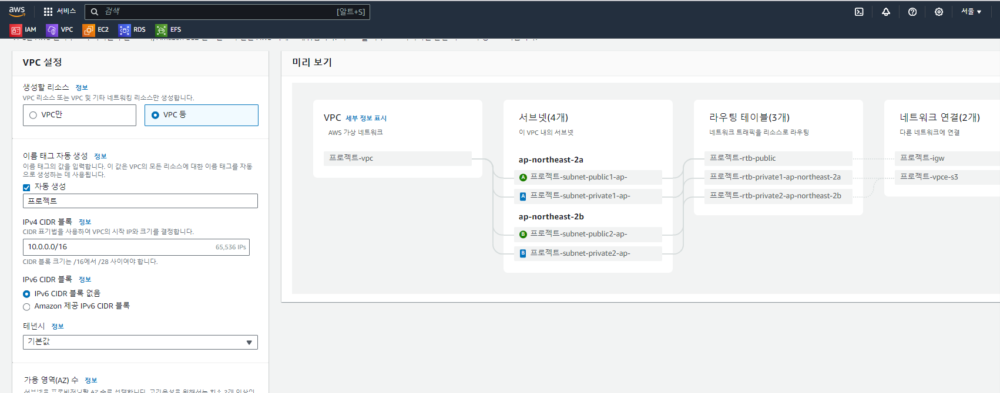

***
# AWS 실습 보충자료

## AWS 학습 사이트
 - [ ] [AWS Workshop](https://workshops.aws/)
   - 분야별 수준별로 실제 클라우드 시나리오를  
     AWS 실습 환경에서 직접 체험해 볼 수 있도록 다양한 실습 가이드를 제공합니다

 - [ ] [AWS Free tier 소개](/AWS/Free%20tier.md) 

## 실습 과제
 - [ ] 클라우드에 고가용성 웹 서비스 구축하기 
   - [Highly Available Web Application Workshop](https://catalog.us-east-1.prod.workshops.aws/workshops/3de93ad5-ebbe-4258-b977-b45cdfe661f1/en-US)
      - 홈페이지, 블로그, 쇼핑몰 등 다양하게 제작이 가능한 오픈소스 서버  
   '워드프레스(Word press)'를 활용하여 간단한 웹서비스를 구축해보는 실습입니다
      - AWS 기본 서비스인 VPC, RDS, EC2, EFS 를 활용해 구축해 봅니다

## AWS START 
 - [ ] AWS 로그인
    - https://aws.amazon.com/ko/  이동
    - "콘솔에 로그인" > "루트 사용자" 선택 > ID/PW 입력 >"로그인"

- [ ] LAB 변경사항
    - VPC 생성방법 : 수동생성 -> 자동생성
      
    - 적용 보안그룹 : 리소스별 SG 생성 -> deault로 변경
      - 실습과정에서 리소스별 Security Group은 모두 default SG로 변경
      - SG 설정 과정은 default SG를 지정
      - 예외 SG : ALB security group "WP Load Balancer"는 추가 생성이 필요하며 ALB 에 추가 적용
        - ALB SG : "default" +  WP Load Balancer"
    

 - [ ] AWS 계정 설정
   - [MFA 설정](/AWS%20Start/MFA.md)
   - [IAM 설정](/AWS%20Start/IAM.md)

 - [ ] EC2 서버 구성/접근
   - [EC2 Launch Template](/EC2%20Acess/Launch%20Template.md)
   - [Session Manager로 EC2 접근](/EC2%20Access/Session%20Manager.md)
   - [ID/PW로 EC2 접근](/EC2%20Access/IDPW.md)

## AWS 정리
 - [ ] [리소스 정리(삭제)](/Delete/Delete%20resource.md) 
   - AWS 계정 해지시에도 비용이 청구될수 있습니다
   - 계정을 혜지하기 전에 AWS Console에 루트계정으로 접속하여 리소스가 정상적으로 삭제되었는지 다시한번 확인합니다
   - 실습과정에 사용된 리소는 IAM, VPC, EC2, RDS, EFS 이 5가지 Console 화면을 벗어나지 않습니다  
   - IAM은 계정관리 서비스로 해당 Console에서 비용발생하는 리소스는 없습니다

## IaC 란
 - [ ] [코드로 인프라 관리하기](/IaC/IaC.md)

## 추가 LAB  
 - [Auto Scaling LAB](/Hidden%20LAB/LAB.md) 
   - 웹서버의 부하 증가시 자동으로 서버가 증설되는 LAB  

## 유용한 도구들
 - [ ] [테스트 도구](/Tools/tools.md)

***
***

