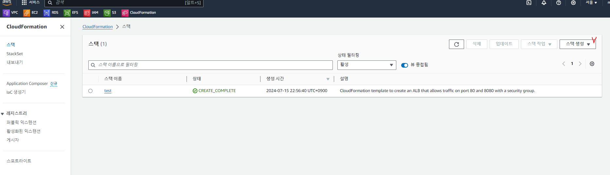
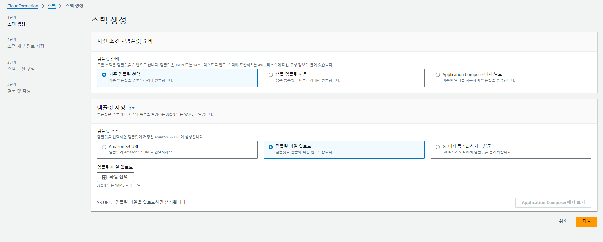
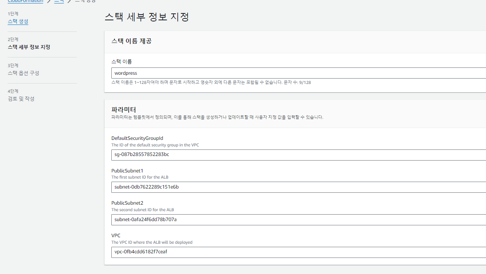
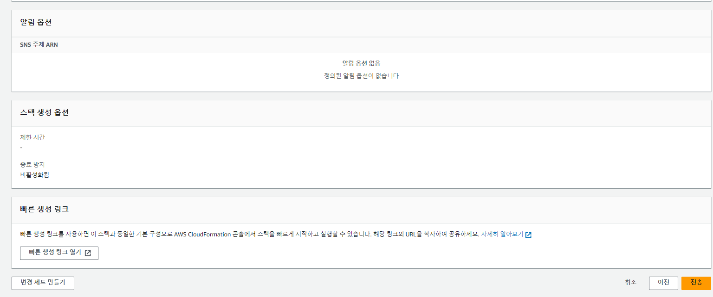
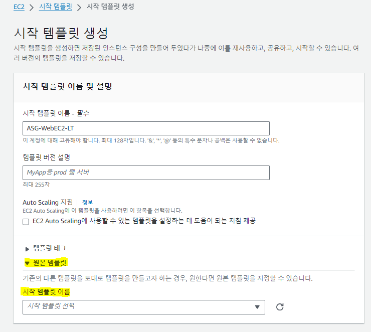

## Auto Scaling 테스트

### IaC 도구 Cloudformation으로 리소스 한번에 생성하기 
- [ ] 지금부터는 ALB + SecurityGroup + Listener + Targetgroup를 한번에 생성합니다
- [ ] Cloudformation 콘솔로 이동합니다
    - [cf 코드 다운](/IaC/iac_alb.yaml)
    - 사이드 메뉴의 "스택" 클릭후 "스택생성" 클릭 > "새 리소스 사용" 선택
    - 템플릿준비 : "기존템플릿",  템플릿지정 : "템플릿 파일 업로드" 선택
    
    
    - 템플릿 이름과 파라미터를 지정지정합니다
        1. 생성한 Wordpress VPC를 지정합니다
        2. VPC의 디폴트 SG를 지정합니다(VPC 콘솔에서 VPC ID 확인후 보안그룹에서 해당하는 디폴트 SG를 지정)
        3. 생성한 Public Subnet A,B를 지정합니다        
    
    - 이후 단계에서는 별도 옵션지정없이 마지막까지 이동후 최종 "전송"버튼을 눌러 코드를 제출합니다
    

***

### Web Server 추가
### Launch Template 생성   
- 접속된 EC2 정보를 표시해주는 간단한 웹 서버를  
부하가 증가하면 AutoScale-out 이 되도록 구성해 봅니다

#### 웹서버 구성
- [ ] 부하분산 테스트를 진행할 ASG "Simple-WebServer-LT" 를 생성합니다
    - 교재 Launch Template "WP-WebServers-LT" 생성부분을 참고하고 user date(사용자 데이터)부분만 아래와 같이 변경합니다
    

    ######
    -  user date(사용자 데이터) 구성

        ```
        #!/bin/bash

        # To connect to your EC2 instance and install the Apache web server with PHP

        yum update -y

        yum install -y httpd php8.1
        systemctl enable httpd.service
        systemctl start httpd
        cd /var/www/html
        wget https://us-west-2-tcprod.s3.amazonaws.com/courses/ILT-TF-200-ARCHIT/v7.5.7.prod-05282af8/lab-2-VPC/scripts/instanceData.zip
        unzip instanceData.zip

        dnf install -y stress-ng

        ```

### 테스트 진행
- [ ] EC2 Web Server에 부하를 발생시켜 Auto Scale out 되도록 합니다
    - [EC2 Access](/EC2%20Access/Session%20Manager.md) 페이지를 참고하여 EC2에 접속합니다
    - [Tools](/Tools/tools.md) 를 참고하여 부하를 발생시키고 MS Edge로 웹 접속
    - 반복해서 웹에 접근하여 증가된 EC2 만큼 웹 접근이 분산되는지 확인합니다
     
***
***